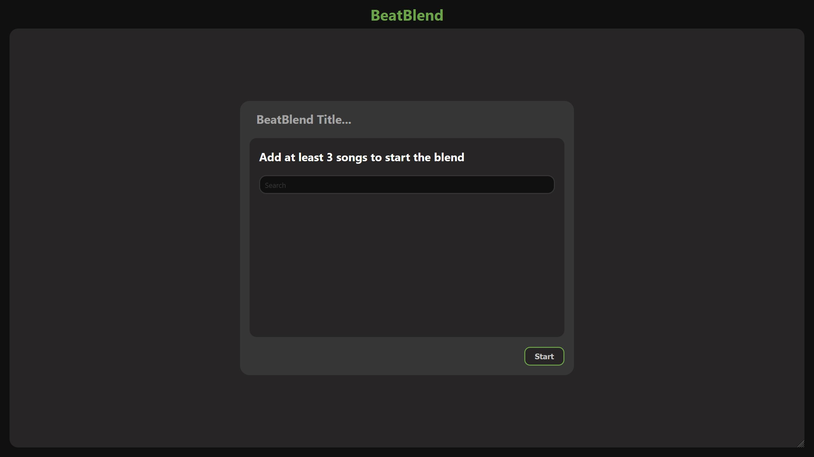
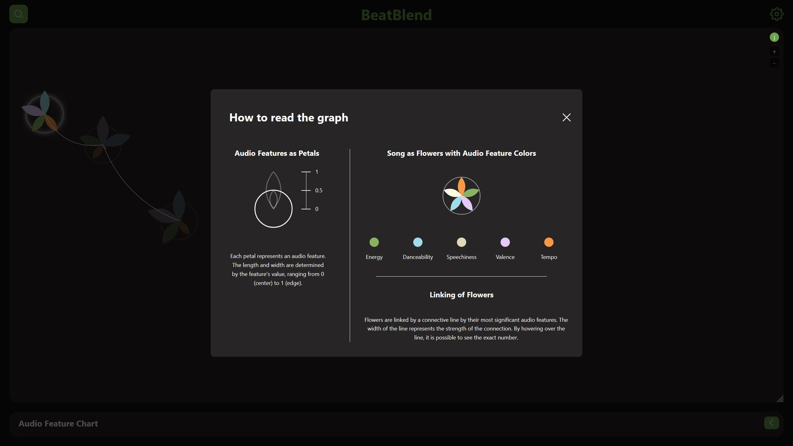
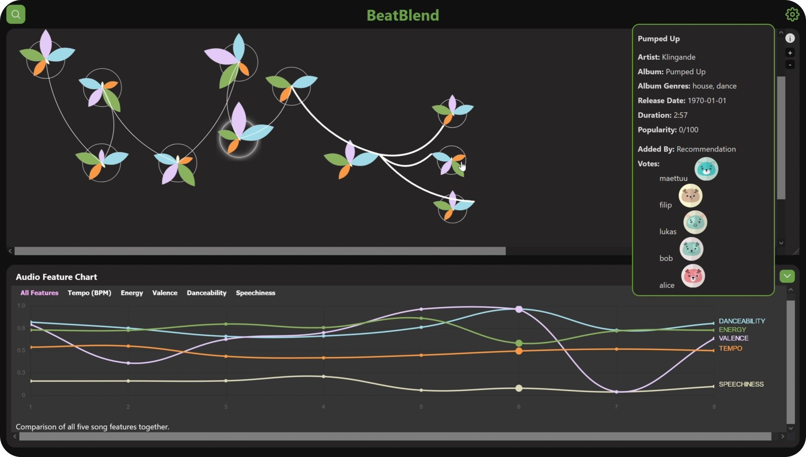
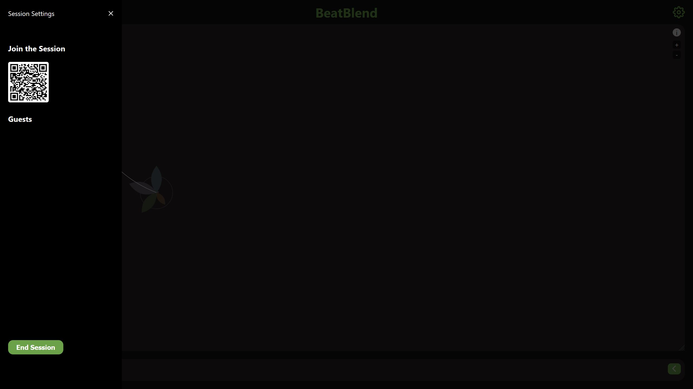
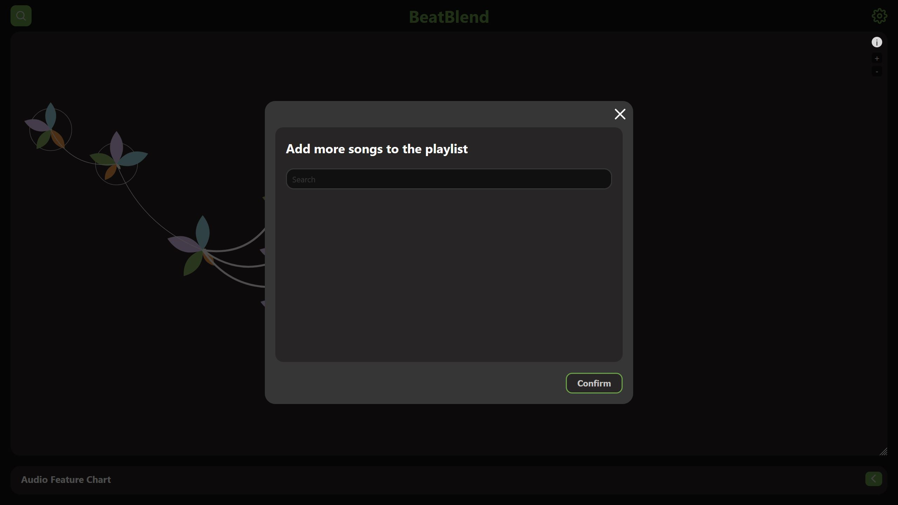
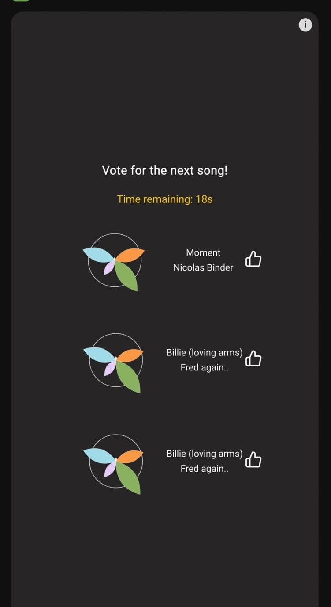
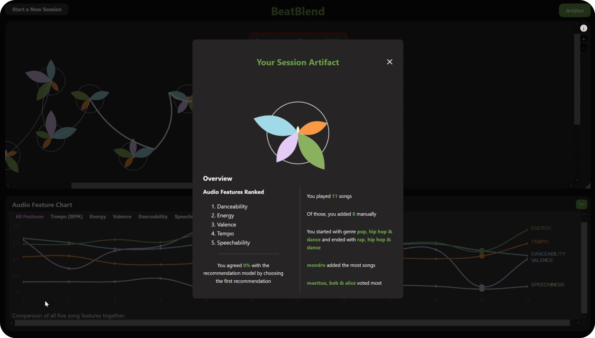

# BeatBlend: Collaborative Music Recommendation System

## Introduction

BeatBlend is a collaborative music recommender system that integrates interactive visualizations and real-time user engagement to create shared music sessions. Using Spotify's API and a unique flower visualization metaphor, BeatBlend allows users to explore audio features, vote on song recommendations, and experience transparent recommendation processes. This repository contains the codebase for the project, including client, server, and infrastructure components.

## Technologies

The project leverages the following technologies:

### Tools, Libraries, and Frameworks
- **Languages:** TypeScript, JavaScript, Python
- **Frontend Framework:** Vue 3
- **Backend Framework:** FastAPI
- **Visualization Library:** Chart.js
- **State Management:** Pinia
- **Database:** PostgreSQL, Redis
- **APIs:** Spotify API, REST API, WebSocket
- **Infrastructure Tools:** Docker, AWS (Elastic Container Service, Relational Database Service, ElastiCache)

### Workflow Version Control
- Git with an adapted Git flow
- Main branch for production-ready code
- Minimum one reviewer for pull requests
- Branch naming conventions
- Issues tracked via GitHub
- Project board for task management and progress tracking

## High-level Components

### Client
The frontend application built with Vue 3 provides an engaging and intuitive user interface. Hosts can:
- Create \"Blend\" sessions to collaboratively build playlists.
- Interact with visualizations showing song audio features.
- View and vote on song recommendations.

### Server
The backend, powered by FastAPI, handles:
- User authentication using JWT tokens.
- Session management for real-time collaborative playlists.
- Song recommendations computed with cosine similarity.
- Real-time WebSocket communication for interactive features.

### Infrastructure
The infrastructure setup leverages:
- Docker for containerized deployment.
- AWS services such as ECS (Elastic Container Service) for running the application, RDS (Relational Database Service) for PostgreSQL, and ElastiCache for Redis.
- A robust deployment strategy using Docker Compose and AWS for scalability and performance.


## Installation, Launch & Deployment

### Prerequisites
- Python v3.12
- Ensure Docker and docker-compose are installed.
- Ensure Node.js (including npm) v20.15.1 (LTS) is installed.

### Cloning
Clone the repository:
```bash
git clone https://github.com/SpotifyMasterProject/BeatBlend.git
```

### Environment Variables

Below is the complete list of environment variables required for running the BeatBlend application. Each variable is explained in detail, including its purpose and default value (if applicable). Variables with default values should not be changed unless specifically required.

#### Spotify API
- `SPOTIFY_CLIENT_ID`: The client ID for your Spotify Developer application. Obtain this from the Spotify Developer Dashboard.
- `SPOTIFY_CLIENT_SECRET`: The client secret for your Spotify Developer application. Obtain this from the Spotify Developer Dashboard.
- `SPOTIFY_REDIRECT_URI`: The URI where Spotify will redirect after user authentication. **Default:** `http://localhost:8080/spotify-callback`.

#### JWT (Authentication)
- `JWT_SECRET_KEY`: A secure key used to sign and verify JWT tokens. **Default:** `test`. Replace this with a strong, secure key in production.
- `JWT_ALGORITHM`: The algorithm used for JWT signing. **Default:** `HS256`.
- `JWT_EXPIRE_MINUTES`: The duration (in minutes) for which JWT tokens remain valid. **Default:** `720` (12 hours).

#### PostgreSQL Database
- `POSTGRES_USER`: The username for your PostgreSQL database.
- `POSTGRES_PASSWORD`: The password for your PostgreSQL database.
- `POSTGRES_HOST`: The hostname of your PostgreSQL server. **Default:** `postgres`.
- `POSTGRES_PORT`: The port used by your PostgreSQL server. **Default:** `5432`.
- `POSTGRES_DB`: The name of your PostgreSQL database. **Default:** `songs`.

#### Redis (Cache and Pub/Sub)
- `REDIS_HOST`: The hostname of your Redis server. **Default:** `redis`.
- `REDIS_PORT`: The port used by your Redis server. **Default:** `6379`.
- `REDIS_SSL`: Indicates whether Redis uses SSL. **Default:** `false`.

#### Discogs API
- `DISCOGS_API_URL`: The base URL for the Discogs API. **Default:** `https://api.discogs.com/database/search`.
- `DISCOGS_API_TOKEN`: Your personal Discogs API token for accessing their database. Obtain this from the Discogs Developer Portal.

#### Application URLs
- `BASE_URL`: The base URL of your application. **Default:** `http://localhost:8080`.
- `API_BASE_URL`: The URL for the backend API. **Default:** `http://localhost:8000`.
- `WS_BASE_URL`: The WebSocket base URL for real-time features. **Default:** `ws://localhost:8000`.

#### Example `.env` File
Below is an example `.env` file with placeholders for required values:

```env
SPOTIFY_CLIENT_ID=<your_spotify_client_id>
SPOTIFY_CLIENT_SECRET=<your_spotify_client_secret>
SPOTIFY_REDIRECT_URI=http://localhost:8080/spotify-callback
JWT_SECRET_KEY=test
JWT_ALGORITHM=HS256
JWT_EXPIRE_MINUTES=720
POSTGRES_USER=<your_postgres_user>
POSTGRES_PASSWORD=<your_postgres_password>
POSTGRES_HOST=postgres
POSTGRES_PORT=5432
POSTGRES_DB=songs
REDIS_HOST=redis
REDIS_PORT=6379
REDIS_SSL=false
DISCOGS_API_URL=https://api.discogs.com/database/search
DISCOGS_API_TOKEN=<your_discogs_api_token>
BASE_URL=http://localhost:8080
API_BASE_URL=http://localhost:8000
WS_BASE_URL=ws://localhost:8000
```

### Application Initialization Guide

Follow these steps to initialize and run the BeatBlend application.

#### Step 1: Build the Docker Images

Before running the application for the first time, or if you have modified any Docker configuration files, you need to build the Docker images. Run `docker compose build`. If you encounter caching issues or suspect outdated dependencies, rebuild the images without cache `docker compose build --no-cache`.

#### Step 2: Start the PostgreSQL Database
Next, start the postgres database by running `docker compose up postgres`. Wait for the database to initialize. This will load the database dump file and set up the necessary tables and data. Once the initialization is complete, stop the database service by pressing Ctrl + C in the terminal.

#### Step 3: Start the Entire Application
Start all required services (frontend, backend, and database) with `docker compose up`. Wait for the containers to fully initialize. The application will now be available at:
- Frontend: http://localhost:8080
- Backend: http://localhost:8000

#### Step 4: Stop the Application
To stop the application, press `Ctrl + C` in the terminal running the Docker services.

## Illustrations
Here is an overview of the application's key screens:

### Home Screen

The first screen displayed when visiting the app's URL. Features a short logo animation for "BeatBlend" and a "Login via Spotify" button.

### Landing Page

Displayed after successful login. Users can start a "Blend" session to create a collaborative playlist.

### Blend Creation Page

Users input a session title and add at least three songs to address the recommender system's cold-start issue.

### Visualization Explanation Pop-up

A tutorial pop-up explaining the flower visualization metaphor and how to interpret audio feature data.


### Main Visualization Page

The primary interface showing the flower visualizations and graphs representing audio features over time.

### Settings Pop-up

Allows access to the session's invite QR code, a list of participants, and the option to end the session.

### Add Song Pop-up

Enables users to manually add songs to the session playlist.

### Voting Screen

A mobile-specific interface where guests can vote for their favorite among the top three recommended songs.

### Artifact

A final summary displayed at the end of a session. Aggregates and visualizes audio features from all songs in the session.

## Authors
>J. Maier, S. Egger, M. Mylaeus, D. Mormocea, Y. Huang

## License

Licensed under GNU General Public License v3.0
- See ...
